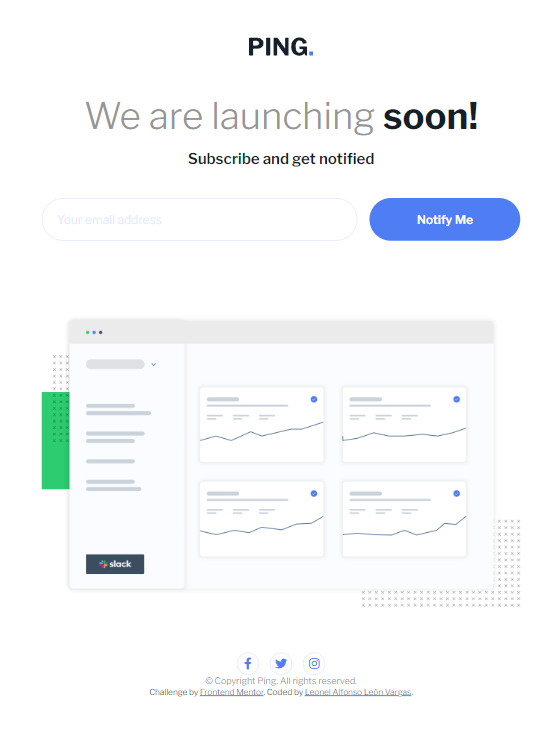
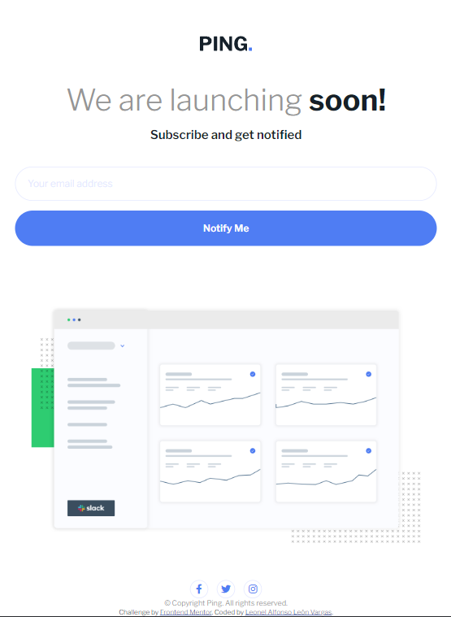

# Frontend Mentor - Ping coming soon page solution

This is a solution to the [Ping coming soon page challenge on Frontend Mentor](https://www.frontendmentor.io/challenges/ping-single-column-coming-soon-page-5cadd051fec04111f7b848da). Frontend Mentor challenges help you improve your coding skills by building realistic projects. 

## Table of contents

- [Overview](#overview)
  - [The challenge](#the-challenge)
  - [Screenshot](#screenshot)
  - [Links](#links)
- [My process](#my-process)
  - [Built with](#built-with)
  - [What I learned](#what-i-learned)
- [Author](#author)


## Overview

### The challenge

Users should be able to:

- View the optimal layout for the site depending on their device's screen size
- See hover states for all interactive elements on the page
- Submit their email address using an `input` field
- Receive an error message when the `form` is submitted if:
	- The `input` field is empty. The message for this error should say *"Whoops! It looks like you forgot to add your email"*
	- The email address is not formatted correctly (i.e. a correct email address should have this structure: `name@host.tld`). The message for this error should say *"Please provide a valid email address"*

### Screenshot






### Links

- Solution URL: https://www.frontendmentor.io/solutions/ping-coming-soon-page-html-css-flexbox-javascript-RAejnYkRvJ
- Live Site URL: https://leon2610.github.io/Ping-coming-soon-page-challenge/

## My process

### Built with

- Semantic HTML5 markup
- CSS custom properties
- Flexbox
- Mobile-first workflow
- JavaScript for form validation


### What I learned

- To validate an email with JavaScript through regular expressions, the test method verify if the value that the user insert in the input is an email or not.

```js
const emailValidator = (email) => {
  const regex =
    /^([a-zA-Z0-9_\.\-])+\@(([a-zA-Z0-9\-])+\.)+([a-zA-Z0-9]{2,4})+$/;
  return regex.test(email) ? true : false;
};
```

## Author

- Frontend Mentor - [@Leon2610](https://www.frontendmentor.io/profile/Leon2610)
- Twitter - [@LeoDev26](https://twitter.com/LeoDev26)

